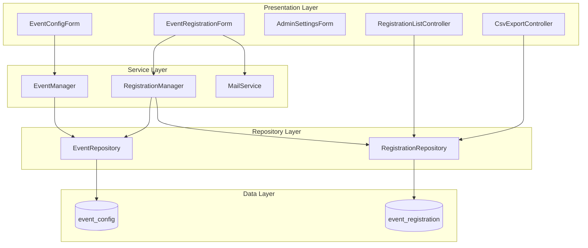

# Event Registration Module

A fully custom Drupal 10 Event Registration System built using **Core APIs only**. This module demonstrates enterprise-level architecture with clean separation of concerns, comprehensive validation, and production-ready code.

## Table of Contents

- [Overview](#overview)
- [Features](#features)
- [Architecture](#architecture)
- [Installation](#installation)
- [Configuration](#configuration)
- [Usage](#usage)
- [Database Schema](#database-schema)
- [Validation Logic](#validation-logic)
- [Email System](#email-system)
- [Security & Standards](#security--standards)
- [Troubleshooting](#troubleshooting)

## Overview

The Event Registration module provides a complete event management and registration system with three main subsystems:

1. **Event Management (Admin)** - Create and configure events with registration windows
2. **Public Registration** - Dynamic AJAX-driven registration form for users
3. **Administration & Reporting** - View, filter, and export registrations with email notifications

### What Makes This Module Different

- ✅ **100% Drupal Core APIs** - No contrib modules required
- ✅ **Dependency Injection** - No `\Drupal::service()` calls in classes
- ✅ **PSR-4 Autoloading** - Professional namespace structure
- ✅ **AJAX-Driven UX** - Dynamic forms with server-side validation fallback
- ✅ **Enterprise Validation** - Duplicate prevention, regex patterns, date logic
- ✅ **Production-Ready** - Config schema, default config, comprehensive error handling

## Features

### Admin Features
- Create events with categories, dates, and registration windows
- Configure email notifications (user + optional admin)
- View all registrations with real-time filtering
- Export filtered data to CSV (Excel-compatible)
- Automatic validation of date logic

### User Features
- Dynamic registration form with AJAX cascading dropdowns
- Real-time validation and error messages
- Email confirmation upon successful registration
- Registration window enforcement

### Technical Features
- Custom database tables (not content types)
- Memory-safe CSV export with streaming
- UTF-8 BOM for Excel compatibility
- Comprehensive logging
- Clean access control

## Architecture

### Module Structure

```
event_registration/
├── config/
│   ├── install/
│   │   └── event_registration.settings.yml    # Default configuration
│   └── schema/
│       └── event_registration.schema.yml      # Config validation schema
├── sql/
│   └── event_registration_tables.sql          # SQL reference
├── src/
│   ├── Access/
│   │   └── RegistrationAccessCheck.php        # Access control logic
│   ├── Controller/
│   │   ├── CsvExportController.php            # CSV export
│   │   └── RegistrationListController.php     # Admin listing
│   ├── Form/
│   │   ├── AdminSettingsForm.php              # Module settings
│   │   ├── EventConfigForm.php                # Event management
│   │   ├── EventRegistrationForm.php          # Public registration (AJAX)
│   │   └── RegistrationFilterForm.php         # Admin filtering (AJAX)
│   ├── Repository/
│   │   ├── EventRepository.php                # Event data access
│   │   └── RegistrationRepository.php         # Registration data access
│   └── Service/
│       ├── EventManager.php                   # Event business logic
│       ├── MailService.php                    # Email notifications
│       └── RegistrationManager.php            # Registration business logic
├── composer.json
├── event_registration.info.yml
├── event_registration.install
├── event_registration.links.menu.yml
├── event_registration.module
├── event_registration.permissions.yml
├── event_registration.routing.yml
├── event_registration.services.yml
└── README.md
```

### Architecture Diagram



## Installation

### Step 1: Copy Module Files

```bash
# Copy module to custom modules directory
cp -r event_registration /path/to/drupal/modules/custom/
```

### Step 2: Enable Module

**Via Drush:**
```bash
drush en event_registration -y
drush cr
```

**Via UI:**
1. Navigate to `/admin/modules`
2. Find "Event Registration" under "Custom"
3. Check the box and click "Install"

### Step 3: Verify Installation

```bash
# Check database tables were created
drush sqlq "SHOW TABLES LIKE 'event_%'"

# Verify routes are registered
drush route:list | grep event

# Check permissions
drush role:perm:list administrator | grep event
```

### Step 4: Assign Permissions

1. Navigate to `/admin/people/permissions`
2. Assign "Administer event registrations" to appropriate roles
3. Save permissions

## Configuration

### Module Settings

Navigate to `/admin/config/events/settings` to configure:

- **Admin Notification Email** - Email address for registration notifications
- **Enable Admin Notifications** - Toggle admin email notifications on/off

### Creating Events

Navigate to `/admin/config/events/manage` to create events:

1. Enter event name
2. Select category (Technical, Cultural, Sports, Workshop, Seminar)
3. Set event date
4. Define registration window (start and end dates)
5. Set status (Active/Inactive)

**Date Validation Rules:**
- Registration end must be after registration start
- Event date must be after registration end

## Usage

### URL Reference

| Page | URL | Access |
|------|-----|--------|
| Event Management | `/admin/config/events/manage` | Admin only |
| Module Settings | `/admin/config/events/settings` | Admin only |
| Public Registration | `/event/register` | All users |
| Registration Listing | `/admin/events/registrations` | Admin only |
| CSV Export | `/admin/events/registrations/export` | Admin only |

### Public Registration Flow

1. User visits `/event/register`
2. Selects **Category** (dropdown populated from active events)
3. Selects **Event Date** (AJAX-filtered by category)
4. Selects **Event Name** (AJAX-filtered by category + date)
5. Enters personal information (name, email, college, department)
6. Submits form

**AJAX Dependency Flow:**
```
Category → Event Date → Event Name
```

### Registration Availability Logic

A registration is **allowed** only when ALL conditions are met:

1. Event exists in database
2. Event status is **Active** (`status = 1`)
3. Current datetime is **≥ Registration Start** (`reg_start`)
4. Current datetime is **≤ Registration End** (`reg_end`)
5. No duplicate registration exists (same email + event_id)

**Server-side enforcement:** All validation is performed server-side, independent of AJAX state.

### Admin Filtering & Export

1. Navigate to `/admin/events/registrations`
2. Use filter form to select:
   - Event Date (AJAX updates event name dropdown)
   - Event Name (filtered by selected date)
3. Click "Filter" to update table
4. Click "Export to CSV" to download filtered results

**Filter Consistency:** CSV export uses the same filters as the admin listing view.

## Database Schema

### Table: `event_config`

Stores event configuration and registration windows.

| Field | Type | Description |
|-------|------|-------------|
| `id` | INT (PK) | Event ID |
| `event_name` | VARCHAR(255) | Event name |
| `category` | VARCHAR(100) | Event category |
| `event_date` | VARCHAR(20) | Event date (YYYY-MM-DD) |
| `reg_start` | INT | Registration start timestamp |
| `reg_end` | INT | Registration end timestamp |
| `status` | TINYINT | Active (1) / Inactive (0) |
| `created` | INT | Created timestamp |

**Indexes:** `category`, `event_date`, `status`

### Table: `event_registration`

Stores user registrations.

| Field | Type | Description |
|-------|------|-------------|
| `id` | INT (PK) | Registration ID |
| `event_id` | INT (FK) | References `event_config.id` |
| `full_name` | VARCHAR(255) | Registrant name |
| `email` | VARCHAR(255) | Registrant email |
| `college` | VARCHAR(255) | College name |
| `department` | VARCHAR(255) | Department name |
| `created` | INT | Registration timestamp |

**Indexes:** `event_id`, `email`

**Relationship:** `event_registration.event_id` → `event_config.id` (Foreign Key)

## Validation Logic

### Duplicate Prevention

**Definition:** Duplicate = Same Email + Same Event ID

**Enforcement Layers:**
1. `RegistrationRepository::checkDuplicate()` - Database query
2. `RegistrationManager::isDuplicate()` - Business logic check
3. `EventRegistrationForm::validateForm()` - Form validation

**Why not DB constraint?** Drupal best practice is validation in code for better error messaging and flexibility.

### Text Field Validation

**Pattern:** `/^[a-zA-Z\s]+$/`

**Applied to:**
- Full Name
- College Name
- Department

**Enforcement:** `RegistrationManager::validateTextField()`

**Error Message:** "[Field] must contain only letters and spaces."

### Email Validation

**Service:** `email.validator` (Drupal Core)

**Enforcement:** `RegistrationManager::validateEmail()`

### Date Validation

**Rules:**
1. `reg_end` > `reg_start`
2. `event_date` > `reg_end`

**Enforcement:** `EventManager::validateEventDates()`

## Email System

### Architecture

**Responsibility Split:**

**MailService** (`src/Service/MailService.php`):
- Determines recipients (user + optional admin)
- Checks configuration (`admin_notification_enabled`)
- Calls `mail.manager->mail()`
- Logs success/failure

**hook_mail()** (`event_registration.module`):
- Defines email subject templates
- Builds email body HTML
- Populates dynamic tokens (name, event, date)
- Handles both `user_confirmation` and `admin_notification` keys

### Email Sending Rules

**User Confirmation:**
- **Always sent** to registrant's email
- Subject: "Registration Confirmation - [Event Name]"
- Contains: Name, Event Name, Event Date, Category

**Admin Notification:**
- **Conditionally sent** based on config
- Requires: `admin_notification_enabled = TRUE`
- Requires: Valid `admin_email` configured
- Subject: "New Registration - [Event Name]"
- Contains: All user details + college + department

## Security & Standards

### Permissions

**Permission:** `administer event registrations`

**Grants access to:**
- Event management form
- Module settings
- Registration listing
- CSV export

**Public access:**
- Registration form (`/event/register`)

### Dependency Injection

✅ **All services use constructor injection**
❌ **No `\Drupal::service()` calls in classes**

Example:
```php
public function __construct(EventRepository $event_repository) {
  $this->eventRepository = $event_repository;
}
```

### AJAX Security

**Risk Mitigation:**
- AJAX callbacks are for UX only (dynamic field population)
- **Server-side validation is completely independent** of AJAX
- Empty or manipulated AJAX values fail validation gracefully
- All business rules enforced in `validateForm()` and service layer

### CSV Export Safety

**Security Measures:**
- Permission check: `administer event registrations`
- Filter consistency with admin listing
- Memory-safe streaming (no full dataset load)
- UTF-8 BOM for Excel compatibility

### Coding Standards

- PSR-4 autoloading
- Drupal coding standards
- Comprehensive PHPDoc comments
- Dependency injection throughout
- Service-oriented architecture

## Troubleshooting

### Tables Not Created

**Symptom:** Module enables but tables missing

**Solution:**
```bash
drush cr
drush updatedb
```

### AJAX Not Working

**Symptom:** Dropdowns don't populate

**Solution:**
1. Clear cache: `drush cr`
2. Check browser console for JavaScript errors
3. Verify routes are registered: `drush route:list | grep event`

### Emails Not Sending

**Symptom:** Registration succeeds but no emails

**Solution:**
1. Check admin settings: `/admin/config/events/settings`
2. Verify email configuration: `/admin/config/system/site-information`
3. Check logs: `/admin/reports/dblog`
4. Test mail system: `drush php-eval "mail('test@example.com', 'Test', 'Test');"`

### Duplicate Registration Error

**Symptom:** "You have already registered for this event"

**Solution:**
- This is expected behavior
- Same email cannot register for same event twice
- Use different email or contact admin to remove previous registration

### Permission Denied

**Symptom:** "Access denied" on admin pages

**Solution:**
1. Verify user has `administer event registrations` permission
2. Navigate to `/admin/people/permissions`
3. Assign permission to appropriate role
4. Clear cache: `drush cr`

## Support & Contribution

This module was built as a demonstration of Drupal 10 best practices and enterprise-level architecture.

**Key Learning Points:**
- Custom database tables vs content types
- Service-oriented architecture
- AJAX with server-side validation
- Email system integration
- CSV export with streaming
- Comprehensive validation strategies

---

**Module Version:** 1.0.0  
**Drupal Version:** 10.x  
**License:** GPL-2.0-or-later
